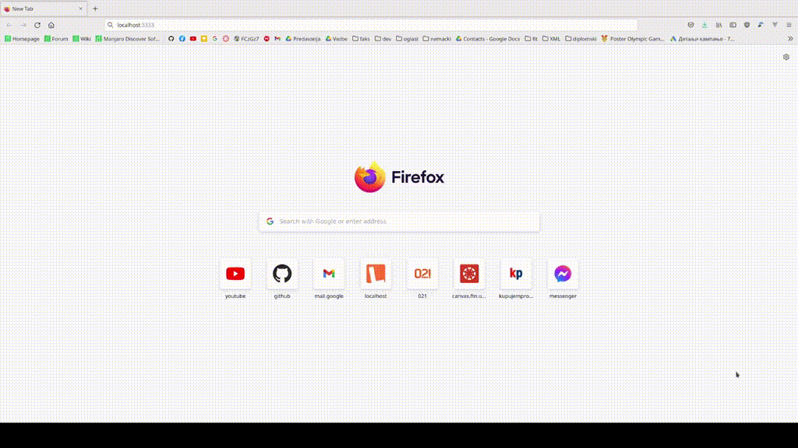

# go-pipelines

Repozitorijum koji sadrži primenu paketa za protočnu obradu u Go-u. Paket se nalazi ovde: [github.com/ele7ija/pipeline](https://github.com/ele7ija/pipeline).

U ovom repozitorijumu protočna obrada primenjena je na veb server aplikacije za upravljanje velikim brojem slika.

[Nacrt diplomskog rada](NacrtDiplomskogRada.md)

[Pokretanje projekta](Pokretanje.md)

[Rezultati](Rezultati.md)

### Repozitorijum frontenda za go-pipelines - *gollery*

Zaseban repozitorijum na linku: [https://github.com/ele7ija/gollery](https://github.com/ele7ija/gollery)

### Demo 

Dijalog za izbor fajlova nije vidljiv iz nekog razloga.

