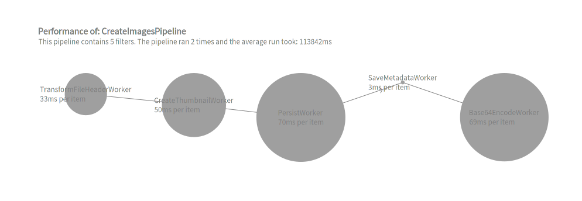
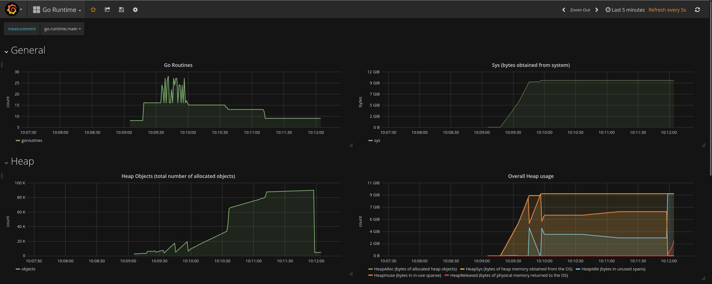
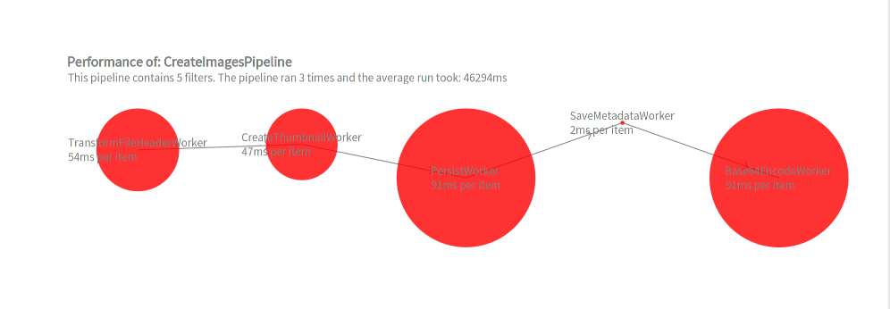
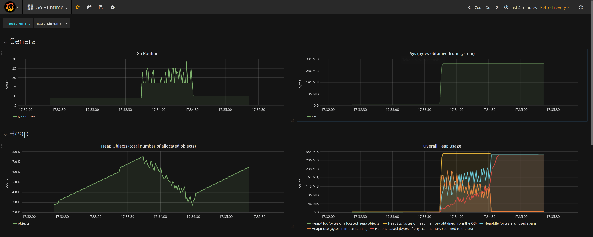
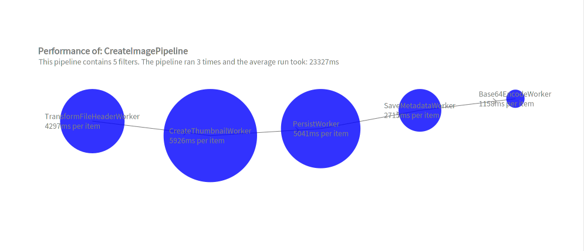
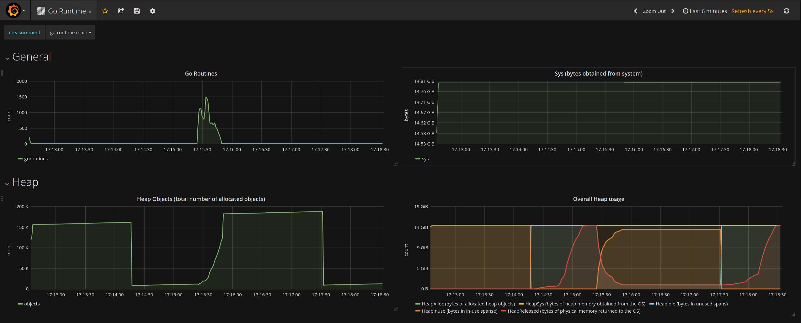
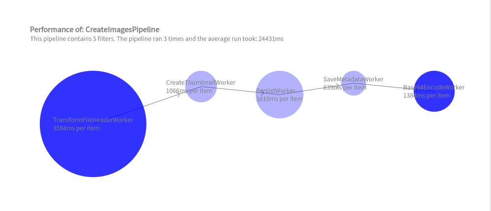
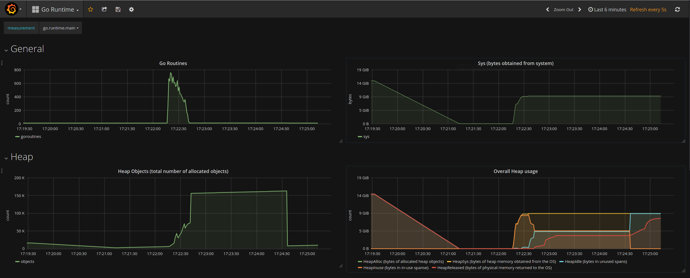

# Primena protočne obrade

Bojan Popržen, 2021.

## Apstrakt

U ovom dokumentu predstaviću rezultate koji su postignuti primenom šablona protočne obrade u Go-u.
Šablon protočne obrade je efikasna kaskadna obrada podataka u više faza.
Šablon protočne obrade primeniću pri izradi veb servera aplikacije za upravljanje velikim brojem slika.
Server mora biti izuzetno efikasan kako bi se smanjilo vreme obrade slika.
Optimalno rešenje za ovaj primer postignuto je kombinacijom Paralelne i Ograničene paralelne protočne obrade.
U odnosu na uobičajeno sekvencijalno rešenje, ubrzanje postignuto optimalnom primenom Šablona protočne
obrade iznosilo je oko 465%.
Pored ubrzane obrade slika, primena Šablona protočne obrade imala je i kvalitativne osobine poput: 
nezavisne izmene faza obrade (filtera), jednostavnog menjanja redosleda faza i tipova faza,
smanjenja grešaka koje su mogle nastati proizvoljnim upravljanjem gorutinama.

## Obrada slika

U ovom poglavlju navešću i objasniću faze pri obradi slika.
Biće posmatran samo slučaj kreiranja slika kao entiteta u sistemu kako bi se kasnije mogle 
pregledati grupno, pojedinačno, brisati itd.

Kreiranje slika kao entiteta u sistemu ima naredne faze:
1. **Transformisanje FileHeader-a**
    
    "Sirovi" preneti bajtovi se dekodiraju i prebacuju u oblik zgodan za naredne transformacije. 
2. **Kreiranje thumbnail-a slike**
   
    Kreira se slika manje rezolucije od originalne koja se koristi za pregledanje grupe slika.
    Prenos slike manje rezolucije zahteva manje resursa i mreže i memorije računara.
3. **Perzistiranje slike**
   
    Slika u originalnoj i u manjoj rezoluciji se čuva na fajl-sistemu računara.
4. **Čuvanje metapodataka**
   
    Metapodaci o slici - naziv, rezolucija, putanje na fajl-sistemu - se čuvaju u bazi podataka.
5. **Enkodiranje bajtova slike u 64-bitnu brojevnu bazu (Base64 encoding)**

    Slika tj. bajtovi slike se enkodiraju u ovom formatu kako bi ceo entitet slike mogao da se
    enkodira u JSON.

## Primenjene obrade

U poglavlju biće navedene različite vrste obrada koje su uzete u obzir za obradu slika. 

### 1. Serijska obrada

Ova obrada nije protočna. Ona treba da prikaže **tradicionalan način obrade slika** pri kome su faze
nezavisne jedna od druge - prvo sve slike prođu kroz jednu fazu pa se potom proslede ka sledećoj.

```go
func MakeCreateImagesPipeline(service ImageService) *pipeApi.Pipeline {

	transformFHWorker := TransformFileHeaderWorker{}
	transformFHFilter := pipeApi.NewIndependentSerialFilter(&transformFHWorker)

	createThumbnailWorker := CreateThumbnailWorker{service}
	createThumbnailFilter := pipeApi.NewIndependentSerialFilter(&createThumbnailWorker)

	persistWorker := PersistWorker{service}
	persistFilter := pipeApi.NewIndependentSerialFilter(&persistWorker)

	saveMetadataWorker := SaveMetadataWorker{service}
	saveMetadataFilter := pipeApi.NewIndependentSerialFilter(&saveMetadataWorker)

	base64Encoder := Base64EncodeWorker{}
	base64EncoderFilter := pipeApi.NewIndependentSerialFilter(&base64Encoder)

	pipeline := pipeApi.NewPipeline("CreateImagesPipeline", transformFHFilter, createThumbnailFilter, persistFilter, saveMetadataFilter, base64EncoderFilter)
	return pipeline
}
```

### 2. Protočna obrada sa serijskim filterima

Protočnu obradu sa serijskim filterima uvrštavam jer je to obrada koja ima svojstvo da redno 
obrađuje slike. Međutim, naš use-case nema ograničenje da je potrebno slike obraditi u
redu u kome su i upload-ovane.

```go
func MakeCreateImagesPipeline(service ImageService) *pipeApi.Pipeline {

	transformFHWorker := TransformFileHeaderWorker{}
	transformFHFilter := pipeApi.NewSerialFilter(&transformFHWorker)

	createThumbnailWorker := CreateThumbnailWorker{service}
	createThumbnailFilter := pipeApi.NewSerialFilter(&createThumbnailWorker)

	persistWorker := PersistWorker{service}
	persistFilter := pipeApi.NewSerialFilter(&persistWorker)

	saveMetadataWorker := SaveMetadataWorker{service}
	saveMetadataFilter := pipeApi.NewSerialFilter(&saveMetadataWorker)

	base64Encoder := Base64EncodeWorker{}
	base64EncoderFilter := pipeApi.NewSerialFilter(&base64Encoder)

	pipeline := pipeApi.NewPipeline("CreateImagesPipeline", transformFHFilter, createThumbnailFilter, persistFilter, saveMetadataFilter, base64EncoderFilter)
	return pipeline
}
```

### 3. Protočna obrada sa paralelnim filterima

Protočna obrada sa paralelnim filterima kreira konkurentni tok izvršavanja za svaki entitet u svakoj
fazi obrade. Ona nema svojstvo da obrađuje entitete u onom redosledu u kome su "došli" na obradu.

Uvrštena je zato što teoretski pruža najbržu moguću obradu entiteta.

```go
func MakeCreateImagesPipeline(service ImageService) *pipeApi.Pipeline {

	transformFHWorker := TransformFileHeaderWorker{}
	transformFHFilter := pipeApi.NewParallelFilter(&transformFHWorker)

	createThumbnailWorker := CreateThumbnailWorker{service}
	createThumbnailFilter := pipeApi.NewParallelFilter(&createThumbnailWorker)

	persistWorker := PersistWorker{service}
	persistFilter := pipeApi.NewParallelFilter(&persistWorker)

	saveMetadataWorker := SaveMetadataWorker{service}
	saveMetadataFilter := pipeApi.NewParallelFilter(&saveMetadataWorker)

	base64Encoder := Base64EncodeWorker{}
	base64EncoderFilter := pipeApi.NewParallelFilter(&base64Encoder)

	pipeline := pipeApi.NewPipeline("CreateImagesPipeline", transformFHFilter, createThumbnailFilter, persistFilter, saveMetadataFilter, base64EncoderFilter)
	return pipeline
}
```

### 4. Protočna obrada sa paralelnim i ograničenim paralelnim filterima

Protočna obrada sa paralelnim i ograničenim filterima u određenim fazama kreira konkurentni tok 
izvršavanja za svaki entitet (paralelni filteri), dok u nekim fazama kreira maksimalno N 
konkurentnih tokova (ograničeni paralelni filteri). 
Ona takođe nema svojstvo da obrađuje entitete u onom redosledu u kome su "došli" na obradu.

Ova obrada uvrštena je zbog ograničenja koja su se javila pri protočnoj obradi sa paralelnim
filterima - ta obrada je koristila previše sistemskih resursa. Do tačnog broja ograničenja (60, 30, 45)
sam došao na osnovu sopstvene procene i na osnovu toga kako se protočna obrada ponašala za 
te različite vrednosti. 

```go
func MakeCreateImagesPipeline(service ImageService) *pipeApi.Pipeline {

	transformFHWorker := TransformFileHeaderWorker{}
	transformFHFilter := pipeApi.NewParallelFilter(&transformFHWorker)

	createThumbnailWorker := CreateThumbnailWorker{service}
	createThumbnailFilter := pipeApi.NewBoundedParallelFilter(60, &createThumbnailWorker)

	persistWorker := PersistWorker{service}
	persistFilter := pipeApi.NewBoundedParallelFilter(30, &persistWorker)

	saveMetadataWorker := SaveMetadataWorker{service}
	saveMetadataFilter := pipeApi.NewBoundedParallelFilter(45, &saveMetadataWorker)

	base64Encoder := Base64EncodeWorker{}
	base64EncoderFilter := pipeApi.NewParallelFilter(&base64Encoder)

	pipeline := pipeApi.NewPipeline("CreateImagesPipeline", transformFHFilter, createThumbnailFilter, persistFilter, saveMetadataFilter, base64EncoderFilter)
	return pipeline
}
```

## Rezultati obrada

U ovom poglavlju opisaću eksperimente nad različitim obradama i predstaviću njihove rezultate.

### Opis eksperimenata

U veb server uvršten je REST API sa endpointom `/images/upload`. 
Svaka od pomenute četiri obrade koristila se za 
opsluživanje zahteva pristiglih na taj endpoint.

Ka endpointu upućena su 3 identična zahteva koristeći namenski frontend.
**Svaki od zahteva sadržao je tačno 500 slika prosečne veličine 116KB**. 

Praćene su sledeće vrednosti tokom izvršavanja zahteva:
- Vreme izvršavanja zahteva kao celine
- Vreme izvršavanja pojedinačne faze  
- Broj gorutina 
- Memorijsko zauzeće programa (broj objekata na Heap-u, veličina Heap-a)

Prve dve stavke prikupljane su u namenski kreiranoj strukturi i vizualizovane su skriptom
u **Pharo implementaciji jezika Smalltalk koristeći biblioteku Roassal**.

Druge dve stavke prikupljane su automatski koristeći paket [go-runtime-metrics](github.com/tevjef/go-runtime-metrics)
koji šalje sistemske podatke programa InfluxDB bazi podataka. Ti su podaci potom vizualizovani u
Grafani.

### Rezultati

| #  | Naziv obrade                               | Broj gorutina | Memorijsko zauzeće | Prosečno vreme izvršavanja |
|----|--------------------------------------------|---------------|--------------------|----------------------------|
| 1. | Serijska                                   | ~ 30          | ~ 9GiB             | **113842ms**                   |
| 2. | Protočna sa serijskim filterima            | ~ 30          | ~ 350MiB           | 46294ms                    |
| 3. | Protočna sa paralelnim filterima           | ~ 1500        | ~ 14GiB            | 23327ms                    |
| 4. | Protočna sa paral. i paral. ogr. filterima | ~ 800         | ~ 9GiB             | **24431ms**                    |

### Rezultati serijske obrade


<p align = "center">Slika 1 - Vreme izvršavanja serijske obrade</p>


<p align = "center">Slika 2 - Broj gorutina i zauzeće resursa serijske obrade</p>

### Rezultati protočne obrade sa serijskim filterima


<p align = "center">Slika 3 - Vreme izvršavanja protočne obrade sa serijskim filterima</p>


<p align = "center">Slika 4 - Broj gorutina i zauzeće resursa protočne obrade sa serijskim filterima</p>

### Rezultati protočne obrade sa paralelnim filterima


<p align = "center">Slika 5 - Vreme izvršavanja protočne obrade sa paralelnim filterima</p>


<p align = "center">Slika 6 - Broj gorutina i zauzeće resursa protočne obrade sa paralelnim filterima</p>

### Rezultati protočne obrade sa paralelnim i ograničenim paralelnim filterima


<p align = "center">Slika 7 - Vreme izvršavanja protočne obrade sa paral. i ogr. paral. filterima</p>


<p align = "center">Slika 8 - Broj gorutina i zauzeće resursa protočne obrade sa paral. i ogr. paral. filterima</p>

### Analiza rezultata


Navešću par glavnih zaključaka o rezultatima eksperimenata:

- Činjenica da je **protočna obrada sa paralelnim filterima najbrža** ne čudi, međutim velika količina
  resursa koje ta obrada koristi nije poželjna u praksi.
  **Protočna obrada sa paralelnim i ograničenim paralelnim filterima, pak, za 4.5% sporiju obradu
  podataka zauzima 36% manje memorije i kreira 46% manje gorutina nego ona sa samo paralelnim filterima**.

- **Sličan broj gorutina kod serijske obrade i kod protočne obrade sa serijskim filterima** je očekivan,
jer obe kreiraju konkuretne tokove izvršavanja samo za različite faze obrade, ali ne i za entitete.

- **Memorijsko zauzeće protočne obrade sa serijskim filterima je veoma malo** u odnosu na druge obrade.
To je zato što ona u svakom momentu ne obrađuje puno entiteta odjednom (paralelni filteri) niti 
  ih skladišti (serijska obrada).
  Oni entiteti koji su obrađeni, ne zauzimaju više memoriju (poslati su enkodirani preko mreže).
  **Malo zauzeće memorije je čini veoma poželjnom
  u praksi i smatram da je dobra praksa da prva obrada koja se primenjuje na bilo koji problem
  bude upravo protočna obrada sa serijskim filterima**.

## Zaključak

Šablon protočne obrade može se uspešno primeniti kod servera koji obrađuju slike.
U zavisnosti kakvi se filteri koriste, protočna obrada se može realizovati na više načina.
Na prikazanom primeru obrade, dobijeno ubrzanje iznosi oko 465%.
Optimalna protočna obrada kombinacija je paralelnih i ograničenih paralelnih filtera.