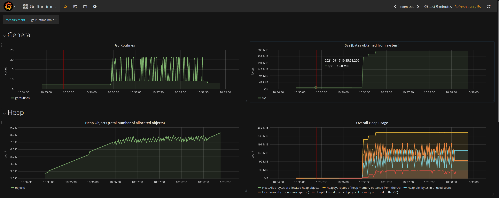
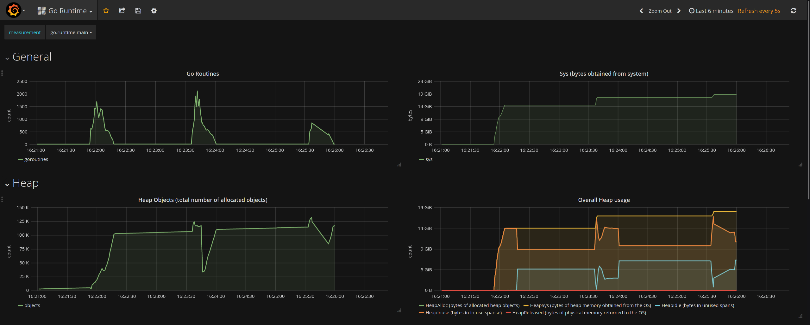
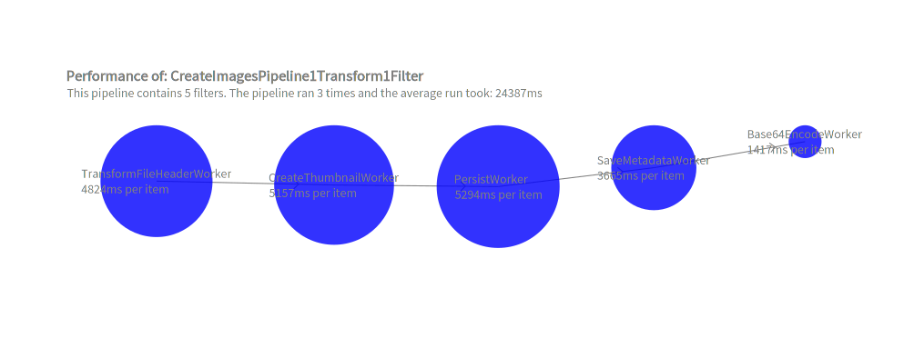
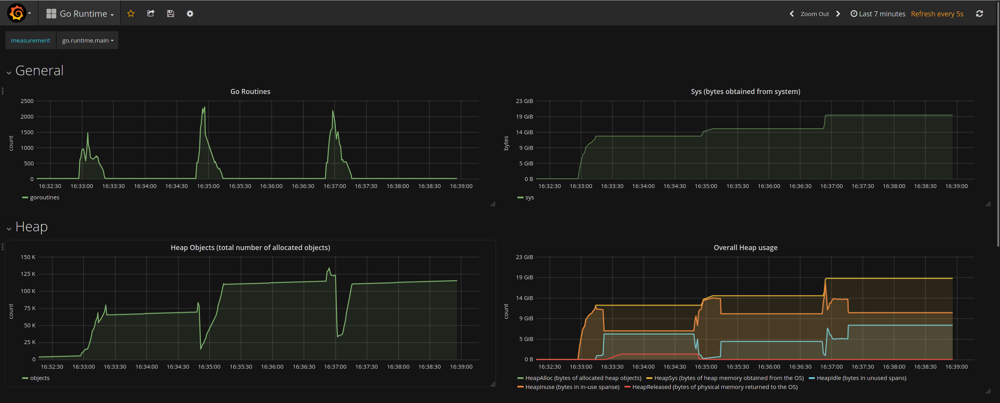
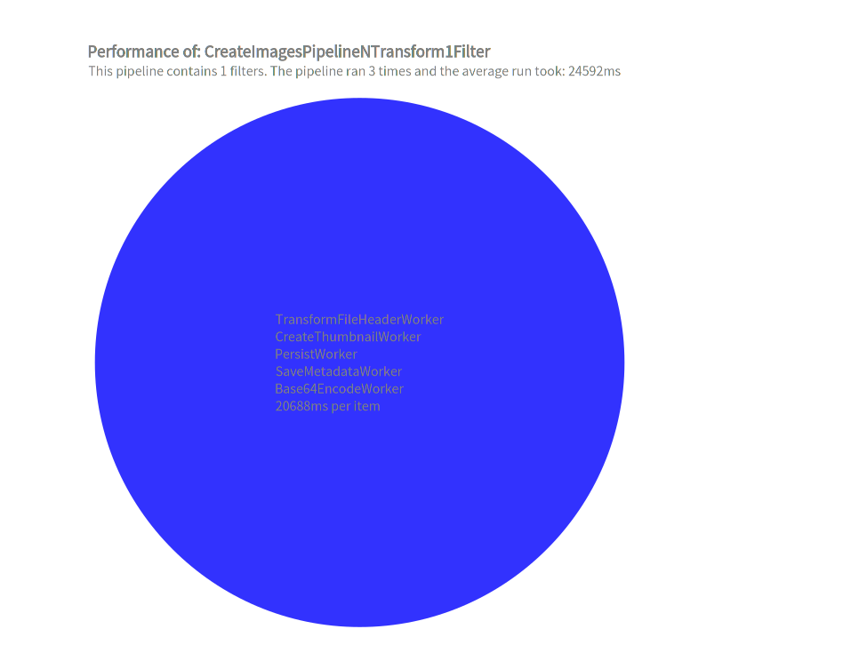
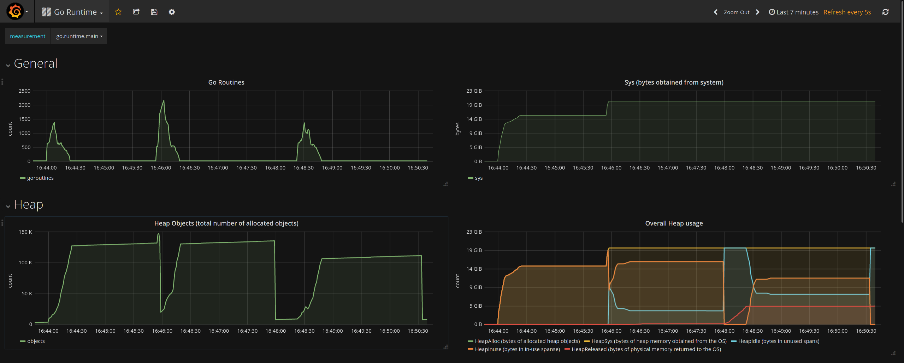
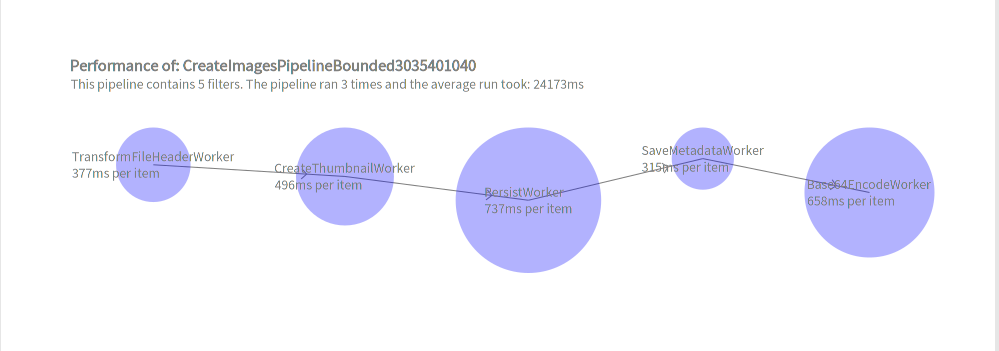
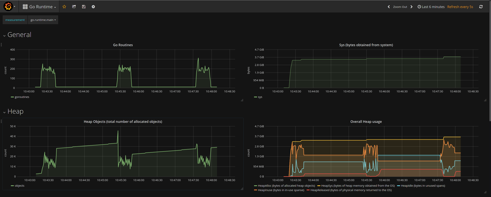

# Primena protočne obrade

Bojan Popržen, 2021.

## Apstrakt

U ovom dokumentu predstaviću rezultate koji su postignuti primenom šablona protočne obrade u Go-u.
Šablon protočne obrade je efikasna kaskadna obrada podataka u više faza.
Šablon protočne obrade primeniću pri izradi veb servera aplikacije za upravljanje velikim brojem slika.
Server mora biti izuzetno efikasan kako bi se smanjilo vreme obrade slika.
Optimalno rešenje za ovaj primer postignuto je kombinacijom Paralelne i Ograničene paralelne protočne obrade.
U odnosu na uobičajeno sekvencijalno rešenje, ubrzanje postignuto optimalnom primenom Šablona protočne
obrade iznosilo je oko 465%.
Pored ubrzane obrade slika, primena Šablona protočne obrade imala je i kvalitativne osobine poput: 
nezavisne izmene faza obrade (filtera), jednostavnog menjanja redosleda faza i tipova faza,
smanjenja grešaka koje su mogle nastati proizvoljnim upravljanjem gorutinama.

## Obrada slika

U ovom poglavlju navešću i objasniću faze pri obradi slika.
Biće posmatran samo slučaj kreiranja slika kao entiteta u sistemu kako bi se kasnije mogle 
pregledati grupno, pojedinačno, brisati itd.

Kreiranje slika kao entiteta u sistemu ima naredne faze:
1. **Transformisanje FileHeader-a**
    
    "Sirovi" preneti bajtovi se dekodiraju i prebacuju u oblik zgodan za naredne transformacije. 
2. **Kreiranje thumbnail-a slike**
   
    Kreira se slika manje rezolucije od originalne koja se koristi za pregledanje grupe slika.
    Prenos slike manje rezolucije zahteva manje resursa i mreže i memorije računara.
3. **Perzistiranje slike**
   
    Slika u originalnoj i u manjoj rezoluciji se čuva na fajl-sistemu računara.
4. **Čuvanje metapodataka**
   
    Metapodaci o slici - naziv, rezolucija, putanje na fajl-sistemu - se čuvaju u bazi podataka.
5. **Enkodiranje bajtova slike u 64-bitnu brojevnu bazu (Base64 encoding)**

    Slika tj. bajtovi slike se enkodiraju u ovom formatu kako bi ceo entitet slike mogao da se
    enkodira u JSON.

## Primenjene obrade

U poglavlju biće navedene različite vrste obrada koje su uzete u obzir za obradu slika. 

### 1. Serijska obrada

Ova obrada nije protočna. Ona treba da prikaže **tradicionalan način obrade slika** pri čemu se
slike obrađuju redno, svaka prođe kroz sve faze pa onda sledeća itd.

```go
func createImagesSequentialUnhandledErrors(db *sql.DB) func(w http.ResponseWriter, r *http.Request) {

    imagesService := workers.NewImageService(db)
    requestCounter := 0
    var requestDuration time.Duration
    
    return func(w http.ResponseWriter, r *http.Request) {
    
        r.ParseMultipartForm(2 << 30) // 1GB
        fhs := r.MultipartForm.File["images"]
        
        w.Header().Set("Content-Type", "application/json")
        w.Write([]byte("{\"images\": ["))
        
        // Process each image sequentially and send it
        started := time.Now()
        for i, fh := range fhs {
        
            f, _ := fh.Open()
            rawimg, _ := jpeg.Decode(f)
            img := workers.NewImage(fh.Filename, rawimg)
            imagesService.CreateThumbnail(r.Context(), img)
            imagesService.Persist(r.Context(), img)
            imagesService.SaveMetadata(r.Context(), img)
            img64 := workers.NewImageBase64(img)
            
            json.NewEncoder(w).Encode(img64)
            if i != len(fhs) - 1 {
                w.Write([]byte(","))
            }
        }
        
        w.Write([]byte("]}"))
        requestCounter++
        requestDuration += time.Since(started)
        log.Infof("[sequential] An average request took: %d ms", requestDuration.Milliseconds() / int64(requestCounter))
    }
}
```

### 2. Konkurentna obrada
Ova obrada takođe nije protočna. 
Ona treba da prikaže **tradicionalan način na koji se ubrza obrada slika u Go-u** pri čemu se
sve faze obrade jedne slike vrše u jednoj gorutini.

```go
func createImagesConcurrentUnhandledErrors(db *sql.DB) func(w http.ResponseWriter, r *http.Request) {

	imagesService := workers.NewImageService(db)
	requestCounter := 0
	var requestDuration time.Duration

	return func(w http.ResponseWriter, r *http.Request) {

		r.ParseMultipartForm(2 << 30) // 1GB
		fhs := r.MultipartForm.File["images"]

		w.Header().Set("Content-Type", "application/json")
		w.Write([]byte("{\"images\": ["))

		// Process each image concurrently and send it
		started := time.Now()
		mu := sync.Mutex{}
		wg := sync.WaitGroup{}
		for _, fh := range fhs {
			wg.Add(1)
			go func(fh *multipart.FileHeader) {
				defer wg.Done()
				f, _ := fh.Open()
				rawimg, _ := jpeg.Decode(f)
				img := workers.NewImage(fh.Filename, rawimg)
				imagesService.CreateThumbnail(r.Context(), img)
				imagesService.Persist(r.Context(), img)
				imagesService.SaveMetadata(r.Context(), img)
				img64 := workers.NewImageBase64(img)

				mu.Lock()
				json.NewEncoder(w).Encode(img64)
				w.Write([]byte(","))
				mu.Unlock()
			}(fh)
		}

		wg.Wait()
		w.Write([]byte("\"void\"]}")) // quick fix to have proper JSON
		requestCounter++
		requestDuration += time.Since(started)
		log.Infof("[concurrent] An average request took: %d ms", requestDuration.Milliseconds() / int64(requestCounter))
	}
}
```


### 3. Protočna obrada sa serijskim filterima

Protočnu obradu sa serijskim filterima uvrštavam jer je to obrada koja ima svojstvo da redno 
obrađuje slike. Međutim, naš use-case nema ograničenje da je potrebno slike obraditi u
redu u kome su i upload-ovane.

Napomena: Sve transformacije nad podacima (workeri) su u ovom primeru mogli biti smešteni
u jedan filter. Međutim, realizacija u formi jedna transformacija - jedan filter je tu
kako bismo incijalno lakše analizirali performanse pojedinačnog filtera. 


```go
func MakeCreateImagesPipeline(service ImageService) *pipeApi.Pipeline {

	transformFHWorker := TransformFileHeaderWorker{}
	transformFHFilter := pipeApi.NewSerialFilter(&transformFHWorker)

	createThumbnailWorker := CreateThumbnailWorker{service}
	createThumbnailFilter := pipeApi.NewSerialFilter(&createThumbnailWorker)

	persistWorker := PersistWorker{service}
	persistFilter := pipeApi.NewSerialFilter(&persistWorker)

	saveMetadataWorker := SaveMetadataWorker{service}
	saveMetadataFilter := pipeApi.NewSerialFilter(&saveMetadataWorker)

	base64Encoder := Base64EncodeWorker{}
	base64EncoderFilter := pipeApi.NewSerialFilter(&base64Encoder)

	pipeline := pipeApi.NewPipeline("CreateImagesPipeline", transformFHFilter, createThumbnailFilter, persistFilter, saveMetadataFilter, base64EncoderFilter)
	return pipeline
}
```

### 4. Protočna obrada sa paralelnim filterima
#### a. Jedna transformacija - jedan filter

Protočna obrada sa paralelnim filterima kreira konkurentni tok izvršavanja za svaki entitet u svakoj
fazi obrade. Ona nema svojstvo da obrađuje entitete u onom redosledu u kome su "došli" na obradu.

Uvrštena je zato što teoretski pruža najbržu moguću obradu entiteta.

Napomena: Sve transformacije nad podacima (workeri) su u ovom primeru mogli biti smešteni
u jedan filter. Međutim, realizacija u formi jedna transformacija - jedan filter je tu
kako bismo incijalno lakše analizirali performanse pojedinačnog filtera. Obrada 4b treba da
ilustruje tu obradu.

```go
func MakeCreateImagesPipeline1Transform1Filter(service ImageService) *pipe.Pipeline {

    transformFHWorker := TransformFileHeaderWorker{}
    transformFHFilter := pipe.NewParallelFilter(&transformFHWorker)
    
    createThumbnailWorker := CreateThumbnailWorker{service}
    createThumbnailFilter := pipe.NewParallelFilter(&createThumbnailWorker)
    
    persistWorker := PersistWorker{service}
    persistFilter := pipe.NewParallelFilter(&persistWorker)
    
    saveMetadataWorker := SaveMetadataWorker{service}
    saveMetadataFilter := pipe.NewParallelFilter(&saveMetadataWorker)
    
    base64Encoder := Base64EncodeWorker{}
    base64EncoderFilter := pipe.NewParallelFilter(&base64Encoder)
    
    pipeline := pipe.NewPipeline("CreateImagesPipeline1Transform1Filter", transformFHFilter, createThumbnailFilter, persistFilter, saveMetadataFilter, base64EncoderFilter)
    pipeline.StartExtracting(5 * time.Second)
    return pipeline
}
```

#### b. Više transformacija - jedan filter

```go
func MakeCreateImagesPipelineNTransform1Filter(service ImageService) *pipe.Pipeline {

    transformFHWorker := TransformFileHeaderWorker{}
    createThumbnailWorker := CreateThumbnailWorker{service}
    persistWorker := PersistWorker{service}
    saveMetadataWorker := SaveMetadataWorker{service}
    base64Encoder := Base64EncodeWorker{}
    
    filter := pipe.NewParallelFilter(&transformFHWorker, &createThumbnailWorker, &persistWorker, &saveMetadataWorker, &base64Encoder)
    
    pipeline := pipe.NewPipeline("CreateImagesPipelineNTransform1Filter", filter)
    pipeline.StartExtracting(5 * time.Second)
    return pipeline
}
```

### 5. Protočna obrada sa ograničenim paralelnim filterima

Ova protočna obrada sastoji se od ograničenih filtera koji kreiraju maksimalno N 
konkurentnih tokova za obradu entiteta. 
Ona takođe nema svojstvo da obrađuje entitete u onom redosledu u kome su "došli" na obradu.

Ova obrada uvrštena je zbog ograničenja koja su se javila pri protočnoj obradi sa paralelnim
filterima - **ta obrada je koristila previše sistemskih resursa**. 

Do tačnog broja ograničenja (30, 35, 40, 10, 40)
sam došao na osnovu vremena i resursa koji svaki od filtera crpi. 
Na osnovu prethodnih protočnih obrada, dobijene su tačne informacije koliko pojedinačni filter
traži vremena za obradu jednog entiteta - odnos je otprilike bio 10:15:20:1:20.
Na osnovu dodatnih merenja za različite vrednosti na čiji izbor je najviše uticao navedeni
odnos, došlo se i do navedenog broj ograničenja.

```go
func MakeCreateImagesPipelineBoundedFilters(service ImageService) *pipe.Pipeline {

    transformFHWorker := TransformFileHeaderWorker{}
    transformFHFilter := pipe.NewBoundedParallelFilter(30, &transformFHWorker)
    
    createThumbnailWorker := CreateThumbnailWorker{service}
    createThumbnailFilter := pipe.NewBoundedParallelFilter(35, &createThumbnailWorker)
    
    persistWorker := PersistWorker{service}
    persistFilter := pipe.NewBoundedParallelFilter(40, &persistWorker)
    
    saveMetadataWorker := SaveMetadataWorker{service}
    saveMetadataFilter := pipe.NewBoundedParallelFilter(10, &saveMetadataWorker)
    
    base64Encoder := Base64EncodeWorker{}
    base64EncoderFilter := pipe.NewBoundedParallelFilter(40, &base64Encoder)
    
    pipeline := pipe.NewPipeline("CreateImagesPipelineBounded3035401040", transformFHFilter, createThumbnailFilter, persistFilter, saveMetadataFilter, base64EncoderFilter)
    pipeline.StartExtracting(5 * time.Second)
    return pipeline
}
```

## Rezultati obrada

U ovom poglavlju opisaću eksperimente nad različitim obradama i predstaviću njihove rezultate.

### Opis eksperimenata

U veb server uvršten je REST API sa endpointom `/images/upload`. 
Svaka od pomenute četiri obrade koristila se za 
opsluživanje zahteva pristiglih na taj endpoint.

Ka endpointu upućena su 3 identična zahteva koristeći namenski frontend.
**Svaki od zahteva sadržao je tačno 500 slika prosečne veličine 116KB**. 

Praćene su sledeće vrednosti tokom izvršavanja zahteva:
- Vreme izvršavanja zahteva kao celine
- Vreme izvršavanja pojedinačne faze  
- Broj gorutina 
- Memorijsko zauzeće programa (broj objekata na Heap-u, veličina Heap-a)

Prve dve stavke prikupljane su u namenski kreiranoj strukturi i vizualizovane su skriptom
u **Pharo implementaciji jezika Smalltalk koristeći biblioteku Roassal**.
Ove vizualizacije postoje samo za protočne obrade.

Druge dve stavke prikupljane su automatski koristeći paket [go-runtime-metrics](github.com/tevjef/go-runtime-metrics)
koji šalje sistemske podatke programa InfluxDB bazi podataka. Ti su podaci potom vizualizovani u
Grafani.

### Rezultati

| #   | Naziv obrade                               | Broj gorutina (avg) | Memorijsko zauzeće | Prosečno vreme izvršavanja |
|-----|--------------------------------------------|---------------|--------------------|---------------------------:|
| 1.  | Serijska                                   | ~ 20          | ~ 250MiB           | **129942ms**                   |
| 2.  | Konkurentna                                | ~ 1550        | ~ 14GiB            | 24405ms                    |
| 3.  | Protočna sa serijskim filterima            | ~ 30          | ~ 350MiB           | 46294ms                    |
| 4a. | Protočna sa paralelnim filterima (1na1)    | ~ 2000        | ~ 14GiB            | 24387ms                    |
| 4b. | Protočna sa paralelnim filterima (Nna1)    | ~ 1625        | ~ 14GiB            | 24592ms                    |
| 5.  | Protočna sa paral. ograničenim filterima   | ~ 270         | ~ 3GiB             | ***24173ms***                    |

### 1. Rezultati serijske obrade


<p align = "center">Slika 1 - Broj gorutina i zauzeće resursa serijske obrade</p>

### 2. Rezultati konkurentne obrade


<p align = "center">Slika 2 - Broj gorutina i zauzeće resursa konkurentne obrade</p>

### 3. Rezultati protočne obrade sa serijskim filterima


<p align = "center">Slika 3 - Vreme izvršavanja protočne obrade sa serijskim filterima</p>


<p align = "center">Slika 4 - Broj gorutina i zauzeće resursa protočne obrade sa serijskim filterima</p>

### 4. Rezultati protočne obrade sa paralelnim filterima

#### a. 1 Transformacija 1 filter

<p align = "center">Slika 5 - Vreme izvršavanja protočne obrade sa paralelnim filterima</p>


<p align = "center">Slika 6 - Broj gorutina i zauzeće resursa protočne obrade sa paralelnim filterima</p>

#### b. N Transformacija 1 filter

<p align = "center">Slika 7 - Vreme izvršavanja protočne obrade sa paralelnim filterima</p>


<p align = "center">Slika 8 - Broj gorutina i zauzeće resursa protočne obrade sa paralelnim filterima</p>


### 5. Rezultati protočne obrade sa ograničenim paralelnim filterima


<p align = "center">Slika 9 - Vreme izvršavanja protočne obrade sa ogr. paral. filterima</p>


<p align = "center">Slika 10 - Broj gorutina i zauzeće resursa protočne obrade sa ogr. paral. filterima</p>

### Analiza rezultata


Navešću par glavnih zaključaka o rezultatima eksperimenata:

- Iako kreira daleko manje gorutina od obrada koje su postigle slična vremena, protočna obrada sa paralelnim
  ograničenim filterima traži **89% manje memorije** i **84% manje gorutina** (u odnosu na konkurentnu obradu).
  Činjenica da je ova obrada postigla slično vreme obrade, čak i malo brže, donekle iznenađuje.
  Zaključak jedino može da bude da se Go runtime "gušio" od velikog broja gorutina.

- **Broj gorutina kod serijske obrade i kod protočne obrade sa serijskim filterima** bio bi još sličniji
  da su se sve transformacije nad podacima radile u jednom serijskom filteru.

- **Memorijsko zauzeće protočne obrade sa serijskim filterima je veoma malo** u odnosu na druge
  protočne obrade.
To je zato što ona u svakom momentu ne obrađuje puno entiteta odjednom kao što to rade paralelni filteri.
  Oni entiteti koji su obrađeni, ne zauzimaju više memoriju (poslati su enkodirani preko mreže).
  **Malo zauzeće memorije je čini veoma poželjnom
  u praksi i smatram da je dobra praksa da prva obrada koja se primenjuje na bilo koji problem
  bude upravo protočna obrada sa serijskim filterima**.

## Zaključak

Šablon protočne obrade može se uspešno primeniti kod servera koji obrađuju slike.
U zavisnosti kakvi se filteri koriste, protočna obrada se može realizovati na više načina.
Na prikazanom primeru obrade, dobijeno ubrzanje iznosi 537%.
Optimalna protočna obrada sastoji se od ograničenih paralelnih filtera.